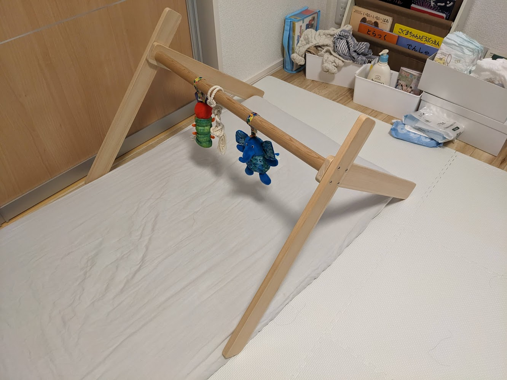
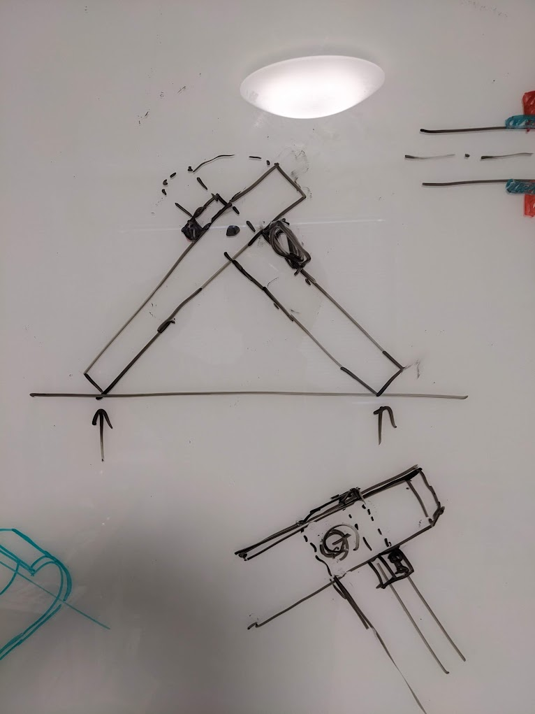
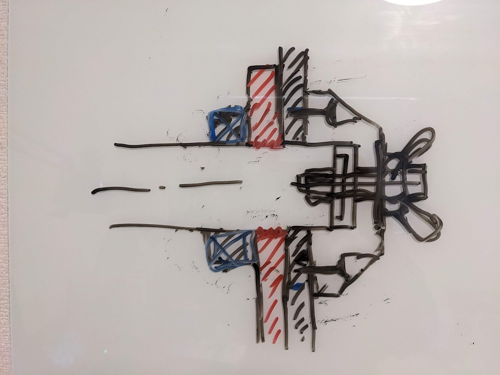

# このDIYプロジェクトの目的
このベビージム（自作）を改良する。

現在は以下の問題がある：
1. 大きくて場所を取る
2. ポール両端の取付部が、モーメントに対して弱いので、そろそろ取れてしまう

これらの問題を、速く、安い方法で解決する。

# 検討中
## 折りめる構造 (2024.3.9)
一方向のみの回転を許すようなストッパーを付ける。  
強度が懸念。

世の中的には、[紐で突っ張ってる形式](https://www.etsy.com/jp/listing/1640807710/montessori-wooden-baby-gym-natural?external=1&rec_type=ad&ref=landingpage_similar_listing_top-3&pro=1&frs=1&plkey=3dd2038aff6b9c6f574c5c438d608b910f611f71%3A1640807710)の物が多い。

## 折りたたむときの回転軸の構造 (2024.3.9)
複雑すぎる気がする。  
3Dプリンターの部品が必要。

